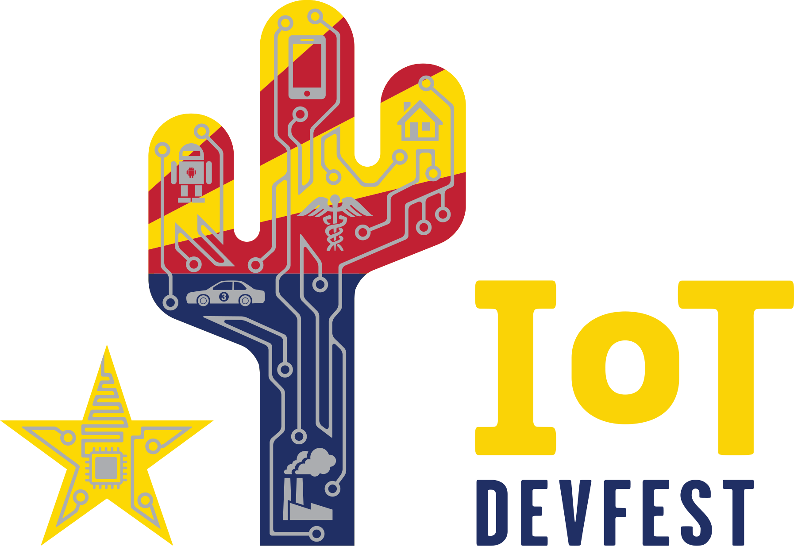

# NOTE

This is a temporary repository for IoT Dev Fest content development. Once we're done the content will be copied to a fresh repo for publication without all the messy history.

# Building Wi-Fi Connected Devices with Arduino
[IoT DevFest](https://www.iotdevfest.com) Workshop - January 26, 2019

Presented by
 * Sandeep Mistry - Arduino
 * Don Coleman - Chariot Solutions
 * Rod Biresch - Chariot Solutions

Hardware Kits Provided by Arduino and Chariot Solutions

<a href="https://arduino.cc"><a/>

## Exercises

* [Intro](exercises/intro.md)
* [Exercise 1: Development Environment](exercises/exercise1.md)
* [Exercise 2: Assemble the Hardware](exercises/exercise2.md)
* [Exercise 3: Sending data using MQTT](exercises/exercise3.md)
* [Exercise 4: Viewing MQTT data](exercises/exercise4.md)
* [Exercise 5: Graphing MQTT Data](exercises/exercise5.md)
* [Exercise 6: Sending Data to Arduino](exercises/exercise6.md)
* [Exercise 7: Connecting using X.509 certs](exercises/exercise7.md)
* [Exercise 8: Running the Prototype](exercises/exercise8.md)

## Slides

The slides are avaialble from [don.github.io/slides](don.github.io/slides/2019-01-26-iotdevfest)
