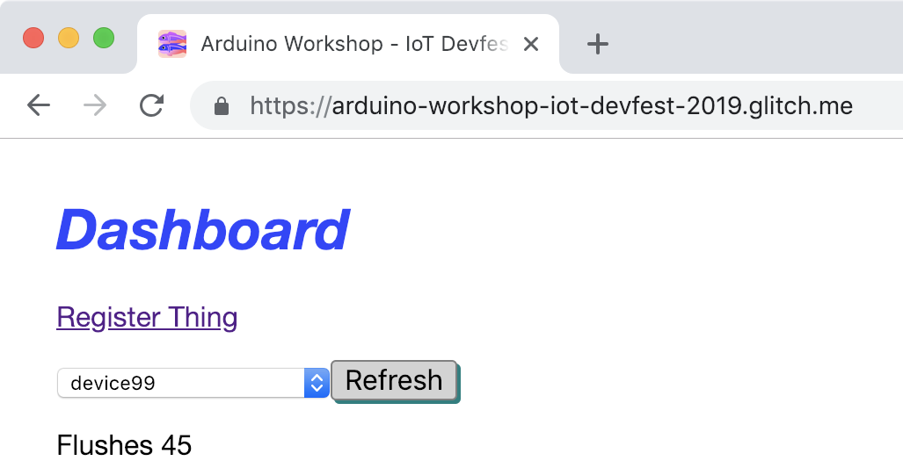
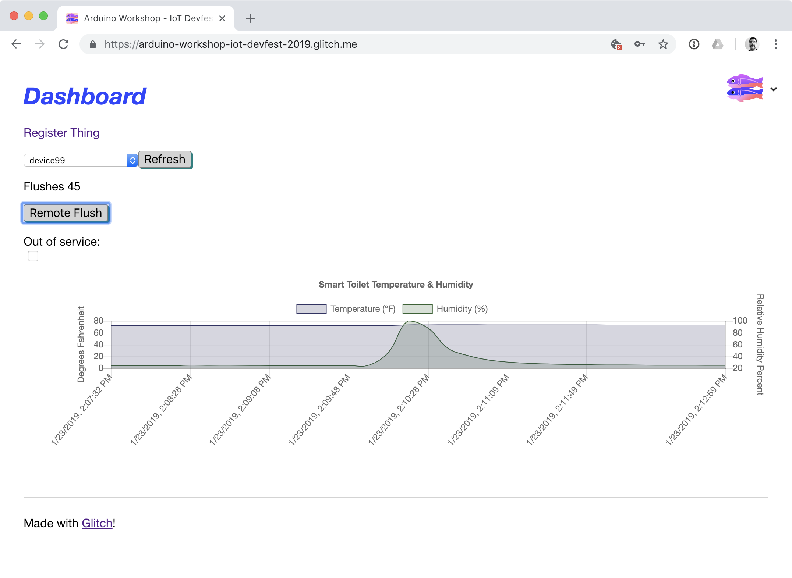
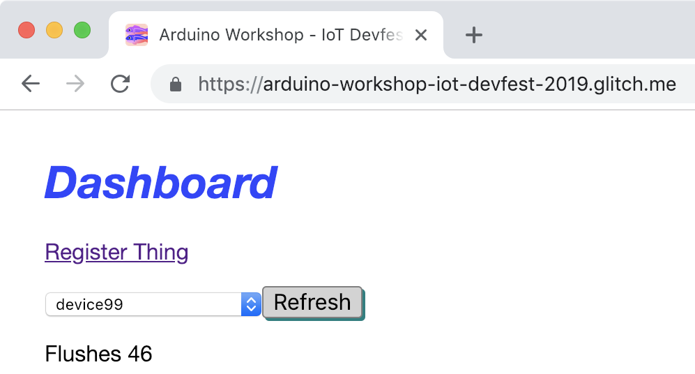
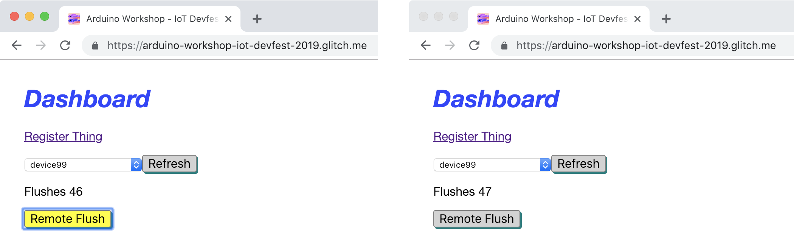
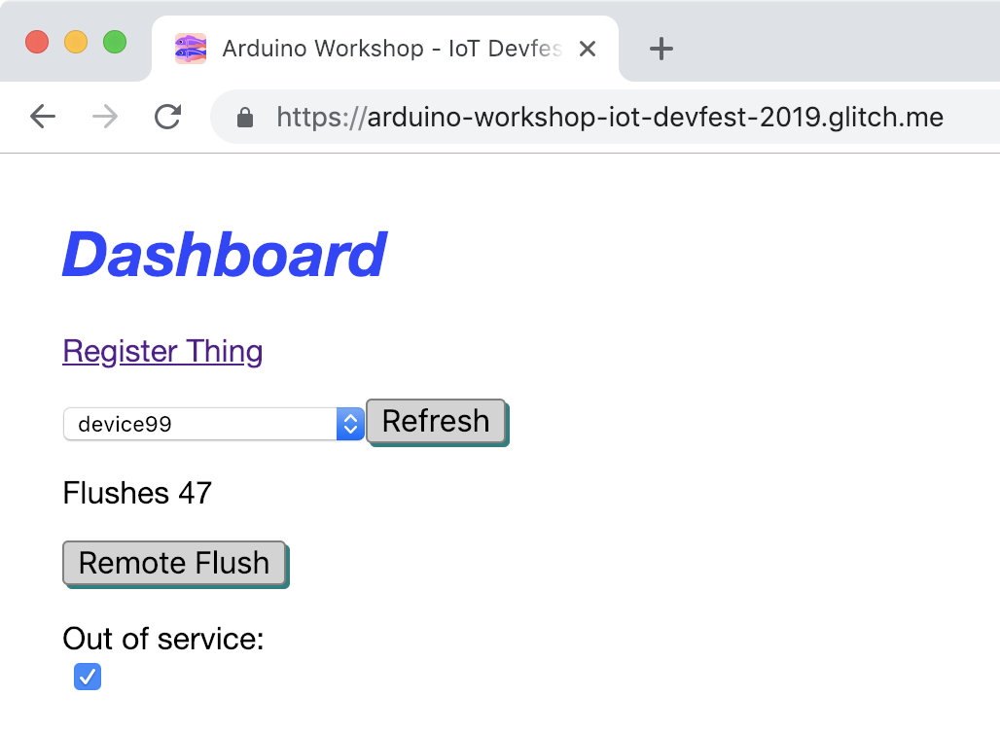
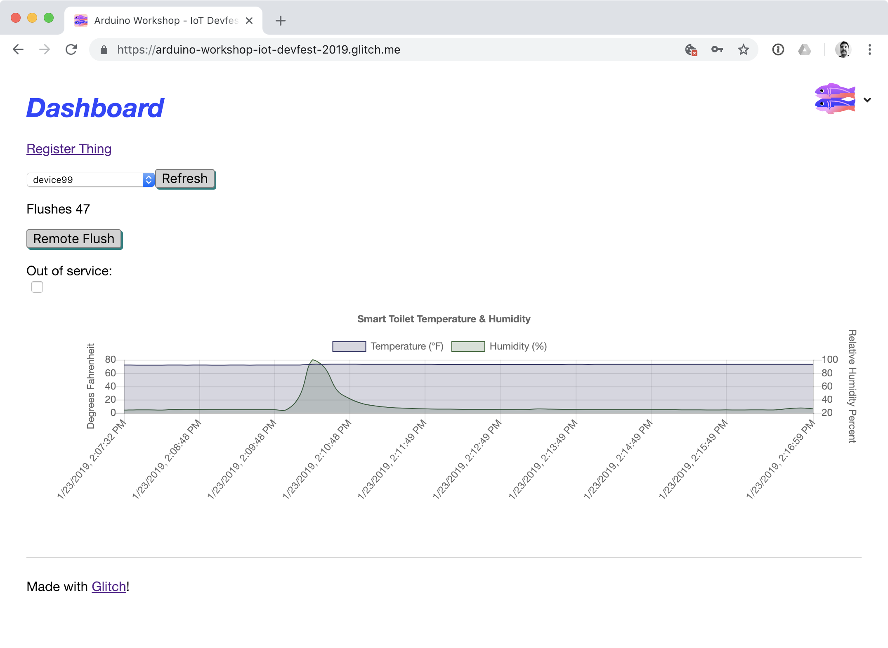
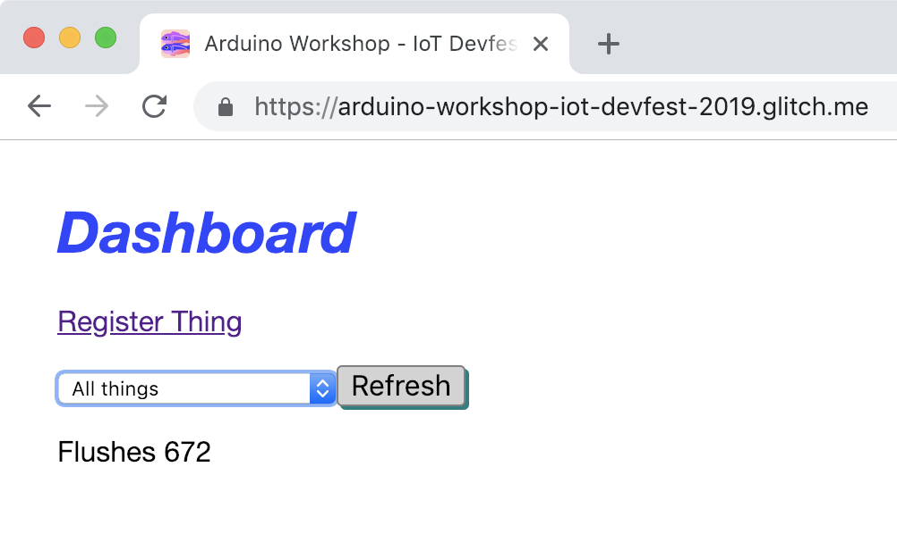
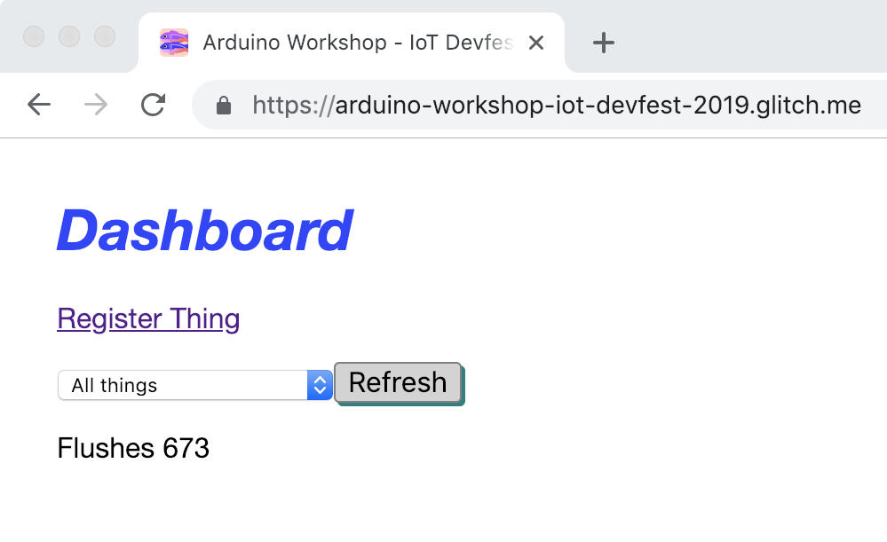
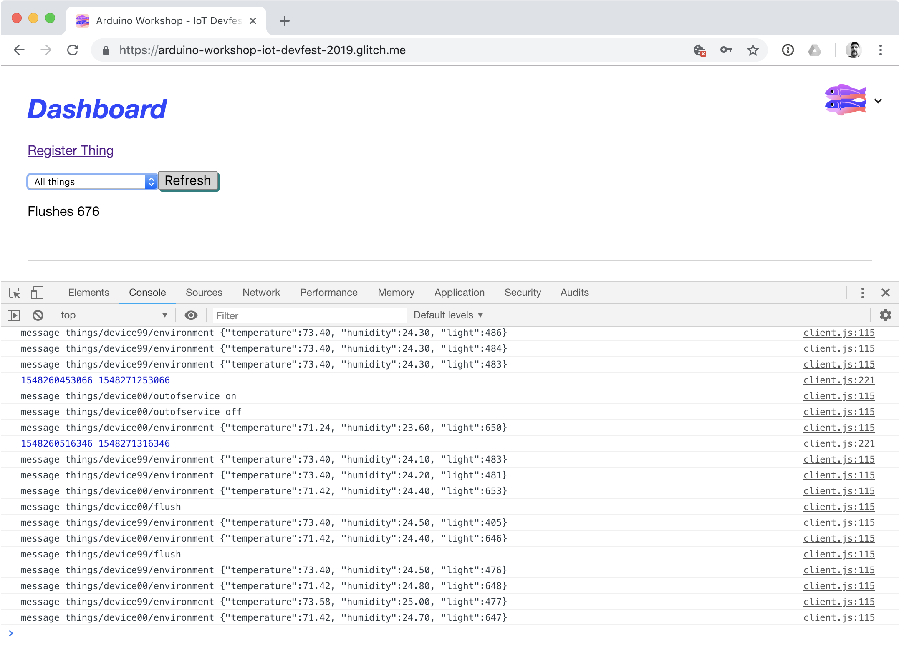

# Exercise 8: Running the Prototype

Now that then config has been setup in the preview exercise, we are ready to upload the SmartToilet sketch on to our board.

1. Upload the code to the board _Sketch -> Upload_
1. Open the serial monitor to view status updates of what the sketch is doing.

    On boot the sketch configures all the sensors and actuators attach on the breadboard, in a similiar way as the previous exercises. It also setups up the crypto element and along the certificate needed for the secure connection to AWS IoT Core. After this is complete it will attempt to connect to the local WiFi network and then once this is succesfully complete, it will attempt to connect to the AWS IoT MQTT broker.
1. Open https://arduino-workshop-iot-devfest-2019.glitch.me/
1. Login with the username and password provided by the instructors.
1. Select your device in the drop down.

    

1. You will see a real-time graph of the environment data sent by the sketch. Every 10 seconds, sensor data is sent to the "things/device*XX*/environment" topic in JSON format. The cloud infrastructure saves this data to a database. The web page creates the graph with data from the database and then subscribes to the same topic appending new data to the graph as it arrives.

    

1. Press the button on the Arduino to simulate a flush. The program sends a MQTT message to the "things/device*XX*/flush" topic and the servo will move 45 degrees. The flush count on the web page will increase by one. The cloud infrastructure saves this event to a database.

    

1. Click the "Remote flush button" on the web page, the browser will send a MQTT message to the "things/device*XX*/remoteflush" topic. When the board receives the message, it will perform a flush operation.

    

1. Check the "Out of service" checkbox on the webpage, the browser will send an "on" message to the "things/device*XX*/outofservice" topic. This activates the out of service indicator LED. When in out of service mode, the button does not trigger. Press the button to confirm no flushing operation is complete.

    

1. Uncheck the "Out of service" checkbox on the webpage, the browser will send an "off" message to the "things/device*XX*/outofservice" topic. The out of service indicator LED will turn off, and flushes can now be triggered via the button.

    

1. Select "All things" in the drop down on the webpage. The web page is subscribed to the "things/+/flush" topic (with wildcard for device id). You will see a global flush count. Press the button to trigger a flush, the count will increment.

    

1. Ask your neighbour to trigger a flush, the count will increment.

    

## Notes

### Viewing MQTT Messages

Incoming MQTT messages are written to the console. If you open the browser debug console, you can view them.

### Device Policies

The cloud infrastructure has been setup in a restrictive manner. AWS Core IoT has a policy applied to enforce the topics a device a device can access.

* If you try to change the device id to something that is different from the certificate's common name, the MQTT connection will be refused.
* If you try to publish or subscribe to topics outside "things/device*XX*/" the MQTT broker will disconnect the connection.

        /* Thing Policy */
        {
            "Version": "2012-10-17",
            "Statement": [
                {
                "Effect": "Allow",
                "Action": "iot:Connect",
                "Resource": "arn:aws:iot:us-west-2:661516571298:client/${iot:Certificate.Subject.CommonName}"
                },
                {
                "Effect": "Allow",
                "Action": "iot:Publish",
                "Resource": "arn:aws:iot:us-west-2:661516571298:topic/things/${iot:ClientId}/*"
                },
                {
                "Effect": "Allow",
                "Action": "iot:Subscribe",
                "Resource": "arn:aws:iot:us-west-2:661516571298:topicfilter/things/${iot:ClientId}/*"
                },
                {
                "Effect": "Allow",
                "Action": "iot:Receive",
                "Resource": "arn:aws:iot:us-west-2:661516571298:topic/things/${iot:ClientId}/*"
                }
            ]
        }

## Bonus

* Use the light sensor to detect the usuage time in seconds and send this time up to the "things/device*XX*/usage" topic.
* If the flush button is not pressed within 30 seconds of activity present, automatically trigger a flush on the device. 
